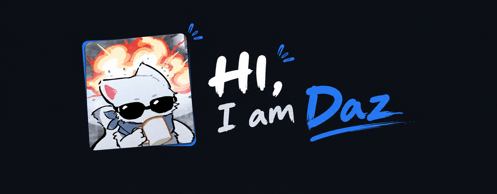
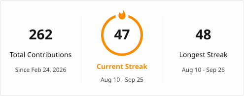

 

---

## ⚡ Projects in Progress

- **[Vehicle parking system](https://github.com/Dazzanova/parking-lot-oop)** — a vehicle parking system implemented using advanced OOP concepts in C++.
- **[KleinGPT](https://github.com/Dazzanova/KleinGPT)** — a basic GPT implemented in vanilla python from scratch.
- **[GoodCode](https://github.com/Dazzanova/GoodCode)** — Structured DSA practice platform focused on problem solving and revision.
- **[More Projects](https://github.com/Dazzanova?tab=repositories)** — Other projects, experiments, and open-source work.

---

## 🛠️ Tech Stack

---

## 🧠 Focus Areas

---

  

