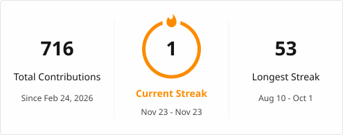
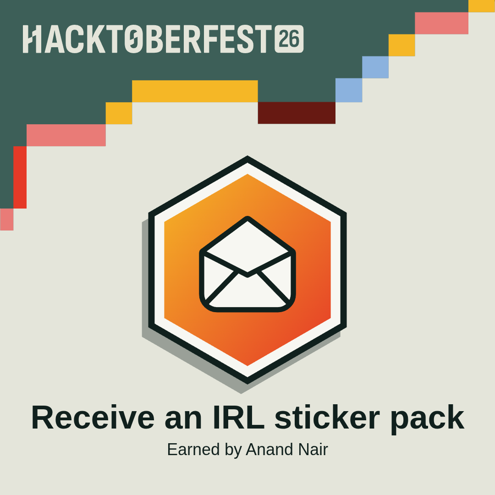

# Hey, I'm Daz👋

Someone who likes to understand how things work under the hood.

Lately, I have been building across systems, developer tools, and ML — from low-level services in Rust to language models built from scratch.

Mostly learning by building, breaking and fixing.

---

<table align="center">
<tr>
<td width="40%" align="center">

</td>

<td width="50%" height="100" align="center">

</td>
</tr>
</table>

 

---

## ⚡ Projects in Progress

- **[CAIRA](https://github.com/Dazzanova/CAIRA)**  
  A research framework for evaluating AI incident-response agents
  under adversarial evidence, with a focus on calibration and auditability.

- **[KleinGPT](https://github.com/Dazzanova/KleinGPT)**  
  Implementing language models from scratch in Python, exploring tokenization, training pipelines, attention mechanisms, and Transformer architecture.

- **[Parking Lot OOP](https://github.com/Dazzanova/parking-lot-oop)**  
  A C++ parking system exploring polymorphism, RAII, smart pointers,
  and the Strategy pattern.

- **[GoodCode](https://github.com/Dazzanova/GoodCode)**  
  A structured space for DSA practice, problem solving, and revision.

[all repositories →](https://github.com/Dazzanova?tab=repositories)

---

## 🛠️ Tech Stack

---

## 🔎 Current Focus

- Building a Redis-like server in Rust to understand Linux internals and systems programming.
- Digging into edge cases, regression testing, and system behavior.
- Contributing targeted fixes to established open-source projects.

---

## 🏅 Recognition

<table border="0">
  <tr>
    <td align="center" valign="middle">
      
    </td>
    <td align="center" valign="middle">
      
    </td>
  </tr>
</table>

  

---

## 🌐 Connect

  
  
  

